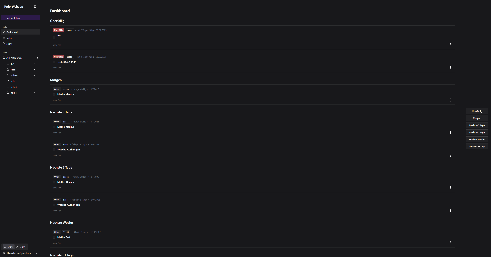
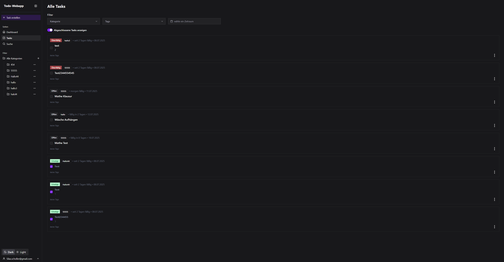

# Dokumentation des Webdesigns #
## Grundlegende Designideen und Ziele
Beim Webdesign der To-Do-App stand von Anfang an im Mittelpunkt, eine übersichtliche, benutzerfreundliche und moderne Oberfläche zu schaffen. Uns war wichtig, dass sich Nutzer schnell zurechtfinden und die App angenehm bedienen können. Deshalb haben wir auf ein einheitliches und konsistentes Design gesetzt. Die Farben, Schriftarten und das Verhalten von interaktiven Elementen sind auf allen Seiten gleich, was für einen vertrauten Look sorgt und die Bedienung intuitiv macht.

## Barrierefreiheit und Nutzerfreundlichkeit ##
Wir legen Wert darauf, dass die App für möglichst viele Menschen gut nutzbar ist. Deshalb achten wir auf klare Kontraste zwischen Text und Hintergrund, damit alles gut lesbar ist. Wenn zum Beispiel ein Pflichtfeld in einem Formular leer bleibt, wird der Rahmen rot markiert (aria-invalid:border-destructive in input.tsx), um sofortiges, klares Feedback zu geben. Die Fehlermeldungen sind zudem klar formuliert, damit jeder sofort versteht, was zu tun ist.

## Layout und Theme-Unterstützung ##
Das Layout der App ist vor allem für die Nutzung am Desktop optimiert, passt sich aber dank Responsive Design auch an kleinere Bildschirme an. Mit Flexbox sorgen wir dafür, dass die Inhalte immer übersichtlich angeordnet sind. Außerdem gibt es einen Dark- und einen Light-Mode (theme.tsx), die sich einfach umschalten lassen. Die Farben, die in globals.css definiert sind, passen sich dabei automatisch an, sodass die App immer gut aussieht – egal, welches Theme man bevorzugt.

## Informationsarchitektur und Nutzerzentrierung ##
Damit man schnell den Überblick behält, ist das Dashboard in verschiedene Bereiche wie „Überfällig“, „Heute“ und „Morgen“ unterteilt (Dashboard.tsx). So kann man auf einen Blick sehen, was als Nächstes ansteht. Dies ist ein Beispiel für eine klare Strukturierung der Benutzeroberfläche. Farben und klar abgegrenzte Überschriften helfen zusätzlich bei der Orientierung.

# Analyse von Beispielseiten #
## Beispiel 1: Die Startseite (Dashboard) ##
Die Startseite (Dashboard.tsx) ist ein gutes Beispiel dafür, wie wir mehrere Gestaltungsprinzipien kombiniert haben, um eine klare und effektive Oberfläche zu schaffen.

### Gesetz der Nähe: ### 
Die Aufgaben werden in logischen Gruppen wie „Heute“, „Morgen“ oder „Überfällig“ dargestellt. Jede dieser Gruppen bildet eine visuelle Einheit, was es dem Nutzer erleichtert, die Zeit Dringlichkeit der Aufgaben schnell zu erfassen.

### Weißraum: ###
Wir setzen bewusst großzügigen Weißraum (p-6, space-y-4) ein, um die einzelnen Sektionen und Aufgabenkarten voneinander abzugrenzen. Das vermeidet eine überladene Optik und lenkt den Fokus auf die wichtigen Inhalte.

### Konsistenz: ###
Jede Aufgabe wird in einer TaskCard dargestellt, deren Aufbau und Design sich auf der gesamten Website wiederholt. Ob im Dashboard, in der Aufgabenübersicht oder in der Suche – der Nutzer erkennt eine Aufgabe immer sofort wieder.

### Sichtbarkeit von Systemzuständen: ###
Der Status einer Aufgabe (z.B. "Offen", "Erledigt", "Überfällig") wird durch farbige Badges (Badge.tsx) deutlich gemacht. Ein überfälliger Task erhält beispielsweise ein rotes "destructive" Badge, was sofort Aufmerksamkeit erregt – ein Beispiel für präattentive Wahrnehmung.

## Beispiel 2: Die Aufgabenübersicht (tasks/page.tsx) ##
Auch in der Aufgabenübersicht zeigt sich, wie durchdachtes Design die Nutzerführung verbessert. Hier kommen zusätzlich zu den bereits genannten Prinzipien weitere zum Tragen:

### Gesetz der Gleichheit: ###
Alle interaktiven Elemente, die zum Filtern dienen (Kategorie- und Tag-Auswahl), sind als MultiSelect-Komponenten (multiselect.tsx) gestaltet und haben ein einheitliches Erscheinungsbild. Der Nutzer lernt einmal, wie sie funktionieren, und kann dieses Wissen überall anwenden.

### Affordances und Constraints: ###
Die Filter-Buttons sehen klickbar aus und deuten durch das Chevron-Icon eine aufklappbare Liste an. Das System schränkt die Auswahlmöglichkeiten sinnvoll ein, indem es nur existierende Kategorien und Tags zur Auswahl stellt (FilterBar.tsx).

### Kombination visueller und textueller Elemente: ###
In der TaskDialog zum Erstellen oder Bearbeiten von Aufgaben werden Icons und Text kombiniert, um die Bedienung zu erleichtern (z.B. das Kalender-Icon neben dem Datumsfeld). Dies erhöht das Verständnis und die Effizienz bei der Bedienung.

### Nutzerkontrolle und Freiheit: ###
Der Nutzer kann jederzeit abgeschlossene Tasks ein- oder ausblenden (showTasksDone in tasks/page.tsx). Dies gibt ihm die Kontrolle darüber, welche Informationen für ihn gerade relevant sind und vermeidet unnötige kognitive Belastung.

## Fazit ##
Zusammengefasst orientiert sich unser Design an modernen Webstandards und den Prinzipien, die wir auch in der Vorlesung kennengelernt haben – insbesondere Konsistenz, Barrierefreiheit und eine klare Informationsstruktur. Die Beispiele zeigen, wie wir diese Ideen praktisch umgesetzt haben. Besonders stolz sind wir darauf, dass das Design überall konsistent ist – von der Aufgabenkarte bis zum Filter. Das macht die App nicht nur benutzerfreundlich, sondern auch professionell und angenehm in der täglichen Nutzung.

Für weiterführende Informationen und theoretische Hintergründe lohnt sich übrigens ein Blick in die Vorlesungsunterlagen und das Webengineering-Repository der DHBW Karlsruhe.
